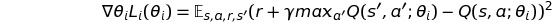
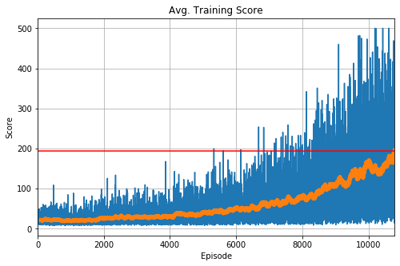

# Reinforcement Learning with Fully-Connected Q-function

A Fully-Connected Q-function (FCQ) uses a Neural Fitted Q-Iteration (NFQ) for solving reinforcement learning problems [1]. It is a value-based method which follows following procedure:
- 1. Collect Experiences Samples
- 2. Calculate Off-Policy TD (Temporal Difference) Targets
- 3. Use an epsilon-greedy strategy to improve policies.
- 4. Use mean squared error (MSE) for loss function.

This is a primitive example of a value-based method which is the precursor of the DQN Algorithm [2]. 
It has no Experience Replay Buffer or does not make use of strategies that limit the correlation between states introduced by the DQN Paper.

In practice, FCQ uses expectation of experience tuples (s,a,r,s') to minimize the following loss function [3]:

## Resources
- A pytorch implementation of FCQ in Pytorch and an RL-Agent using the FCQ Algorithm are given in [FCQ.py](FCQ.py)
- An example using FCQ for solving the Gym CartPole environment is given in [FCQ.ipynb](FCQ.ipynb):

### Reference
- [1] Riedmiller, M. (2005, October). Neural fitted Q iteration–first experiences with a data efficient neural reinforcement learning method. In *European Conference on Machine Learning* (pp. 317-328). Springer, Berlin, Heidelberg
- [2] Mnih, V., Kavukcuoglu, K., Silver, D., Rusu, A. A., Veness, J., Bellemare, M. G., ... & Petersen, S. (2015). Human-level control through deep reinforcement learning. *Nature*, 518(7540), 529-533.
- [3] Morales, M. (2020). Grokking Deep Reinforcement Learning. Manning Publications
